 # Zentient.Endpoints Documentation

Welcome to the official documentation for **Zentient.Endpoints**—a modular, transport-agnostic result adapter for .NET applications.

---

## 🚀 What is Zentient.Endpoints?

Zentient.Endpoints bridges clean `IResult<T>` outcomes from your application layer with HTTP, gRPC, and messaging transports. It enforces structure, observability, and separation of concerns across your service boundaries.

**Core principles:**

- 📦 Protocol-neutral architecture
- 🧱 Clean Architecture alignment
- 🔍 Structured error & metadata handling

---

## 📦 Packages

| Package | Status | Description |
|--------|--------|-------------|
| `Zentient.Endpoints` | ✅ Released | Core result adapter API |
| `Zentient.Endpoints.Http` | 🚧 In Development | ASP.NET integration (filters, mappers) |
| `Zentient.Endpoints.Grpc` | 🧪 Planned | gRPC adapter with trailers & error mapping |

---

## 🏛️ Architecture

---

## 📖 Getting Started

For installation, usage samples, and ASP.NET integration instructions, refer to the [README](../README.md).

---

## 🗺️ Roadmap

See planned features and development updates in the [RELEASE_NOTES.md](../RELEASE_NOTES.md) or the [project board](https://github.com/ulfbou/Zentient.Endpoints/projects).

---

## 🤝 Community & Contribution

If you’d like to contribute, check out our [CONTRIBUTING.md](../CONTRIBUTING.md) and open a [discussion](https://github.com/ulfbou/Zentient.Endpoints/discussions).

Built with ❤️ by [@ulfbou](https://github.com/ulfbou) and the Zentient contributors.
